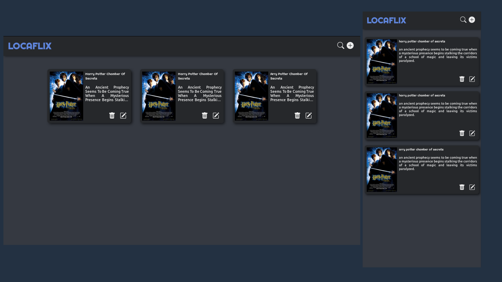

<h1 align="center">Locaflix :ghost:</h1>

<p align="center">
  
  
  
</p>

<p align="center">
  
</p>

<h3>:computer: Tecnologias utilizadas</h3>

<ul>
  <li>ReactJS</li>
  <li>Json-Server</li>
  <li>React-Modal</li>
  <li>React-Responsive</li>
  <li>React-Icons</li>
</ul>

<h3>:pencil2: Como utilizar</h3>

<p>Clone este repositório e instale as dependências</p>

```
  git clone https://github.com/leandro-wrf/locaflix.git
  cd locaflix
  yarn
```

<p>
  Antes de executar o projeto, me deixe clariar algumas coisas,
  estou utilizando o json-server para simular um api rest.
  Como utilizo o meu próprio <a href="https://github.com/leandro-wrf/atom-browser">mini-browser</a>, adicionei um script,
  para não inicializar o browser por padrão. Porém deixei o script
  de start que vem por padrão na criação da aplicação react.
</p>
<p>
  Agora vamos rodar o app:
</p>

```
# Esta linha inicia o servidor rest

  yarn server

# Caso utilize outro browser, use está linha

  yarn dev

# Caso não, pode rodar está linha mesmo

  yarn start

```

<h3>:bulb: Informações das rotas</h3>

<h5>GET lista todos os filmes</h5>

```
  http://localhost:3333/movies
```

<h5>POST add movie</h5>

```
  http://localhost:3333/movies
  --Passe todas as informações que estão marcadas como required
  --No arquivo src/components/modalAdd/
```

<h5>GET filmes por pesquisa</h5>
<p>
  Como não conhecia muito bem o json-server, criei uma lógica dentro do arquivo src/components/Header/index.tsx. Onde eu capturo todos os filmes no banco de dados, e fiz um filtro que atendia aos minhas necessidades.
</p>

<h5>PUT atualize um filme</h5>

```
  http://localhost:3333/movies/movieID
  --Este movieID é o id de identificação do filme
```

<h5>DELETE exclua um filme</h5>

```
  http://localhost:3333/movies/movieID
  --Este movieID é o id de identificação do filme
```

<h3>:nerd_face: O que aprendi neste desafio</h3>

<p align="justify">
  Para falar a verdade muita coisa, resolvi me desafiar, nunca tinha usado telas modais na web, muito menos responsividade, está foi a primeira vez, e digo pela experiência que adquiri
  durantes estes 3 dias, foi até bem simples sua forma de utilizar. Algo que levarem de lição deste desafio é o preparo antes da execução do projeto. Surgiram várias ideias, porém ao invés de sentar e pensar em como aplica-lás partir logo para o código, e tive um dia não muito produtivo. Então resolvi parar e reformular todas as ideias, ajustar tudo e consegui aplicar minhas ideias com maior facilidade. E cheguei a está aplicação final.
</p>

<h3>:memo: Licença</h3>

Licença MIT.
